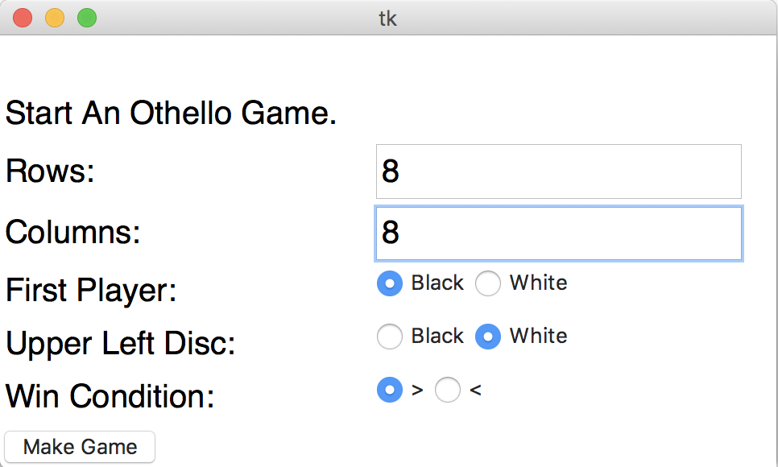
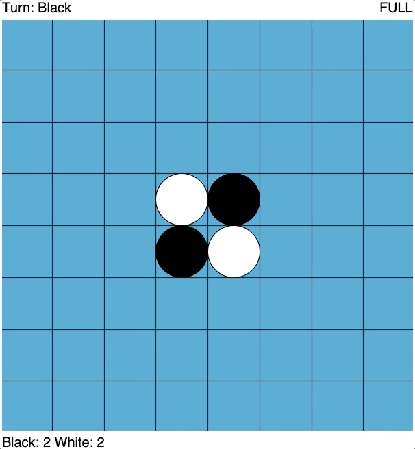

# python-othello

Python version of the game Othello. Made from scratch using Tkinter.

Here is the start menu: 

And here is the gameplay: 

All of the game logic is in the file [new_logic.py](othello/new_logic.py). Here, I have code that checks the win condition.  

	def game_over(self)-> bool:
		'returns true when neither player has a move'
		return not(self.has_move(0) or self.has_move(1))

 And finds which pieces to flip when a move is made. 

	while True:
		if not (self._valid_col(col+direction[1]*n)and self._valid_row(row+direction[0]*n)):
			return []
		if self.board[row+direction[0]*n][col+direction[1]*n] == EMPTY:
			return []
		if self.board[row+direction[0]*n][col+direction[1]*n] == self.getTurn(count_iter):
			for x in range(1,n):
				flipped.append(((row+direction[0]*x),(col+direction[1]*x)))
			return flipped

All of the GUI code is in the file [othell_gui.py](othello/othello_gui.py). Here, I have code that creates a start menu.  

	_game=tkinter.Label(
		master=self._root_window, text='Start An Othello Game.',
		font=_DEFAULT_FONT)

And code that can resize the game board.

	def _on_canvas_resized(self, event: tkinter.Event)->None:
		'Redraws board once its resized'
		self._game_canvas.delete(tkinter.ALL)
		self.drawBoard()
		self.drawCircles()
